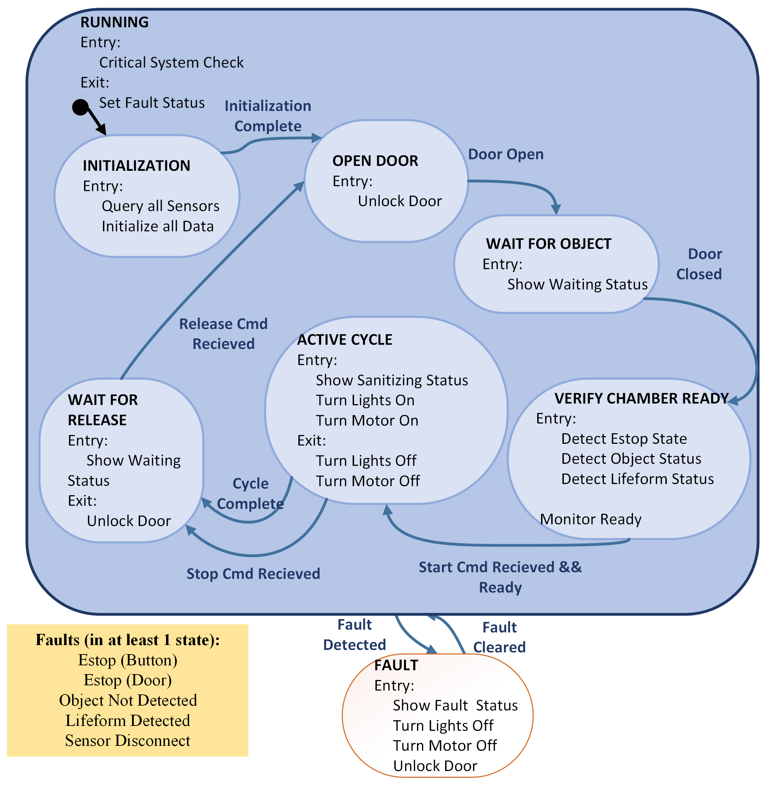

# Design Team 12: Smart-UV Disinfectant

Control-level software to be run on the PIC24FJ128GA010 microcontroller, using the Explorer 16/32 development board.

Upload to microcontroller via MPLAB X IDE v5.50

### State Machine to be implemented:

Upload code to board via an MPLAB X IDE. Version used was v5.50 with the compiler xc16 (v1.70) on the PIC24FJ128GA010 (within the Explorer16).

